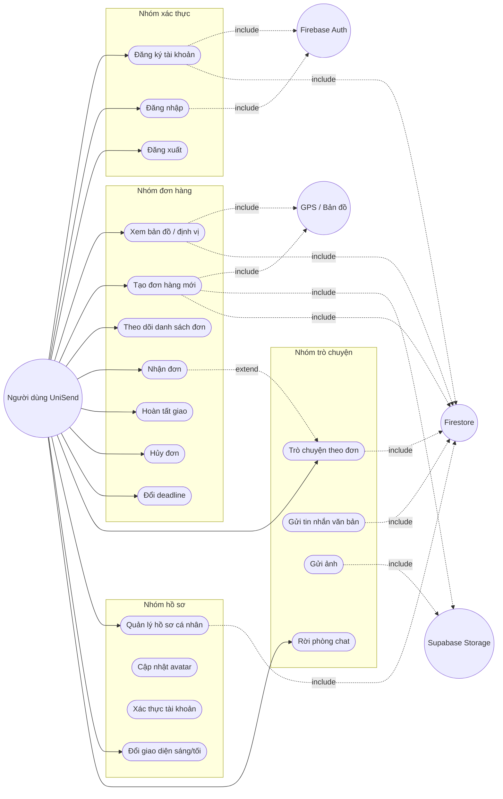

# Báo Cáo Phân Tích Usecase - UniSend

Tài liệu này xây dựng lại nội dung báo cáo theo đúng cấu trúc và logic hiện tại của project UniSend. Mục tiêu là xác định rõ tác nhân, các usecase chính, quan hệ giữa các usecase và những chức năng người dùng đang thao tác trong ứng dụng.

## 1. Phạm vi phân tích

Phạm vi tập trung vào các chức năng người dùng thực sự thấy trên ứng dụng mobile:

1. Xác thực tài khoản.
2. Tạo và theo dõi đơn hàng.
3. Nhận đơn, hoàn tất đơn, hủy đơn.
4. Trò chuyện theo từng đơn hàng.
5. Quản lý hồ sơ cá nhân.
6. Đổi giao diện sáng/tối.

## 2. Tác nhân và hệ thống liên quan

### 2.1. Tác nhân chính

1. Người dùng UniSend: tác nhân trung tâm sử dụng app để đăng ký, đăng nhập, tạo đơn, theo dõi đơn, chat và quản lý hồ sơ.

### 2.2. Tác nhân ngoài hệ thống

1. Firebase Auth: xác thực đăng nhập và đăng ký.
2. Firestore: lưu hồ sơ người dùng, đơn hàng, phòng chat và tin nhắn.
3. Supabase Storage: lưu ảnh đơn hàng và ảnh chat / avatar.
4. GPS / Location Service / OpenStreetMap: lấy vị trí, hiển thị bản đồ và chọn địa chỉ.

## 3. Sơ đồ Usecase tổng quát

## 4. Quan hệ chi tiết giữa các usecase

### 4.1. Nhóm xác thực

1. Đăng ký tài khoản <<include>> kiểm tra email hợp lệ @gmail.com.
2. Đăng ký tài khoản <<include>> kiểm tra tên tài khoản chưa tồn tại.
3. Đăng ký tài khoản <<include>> tạo tài khoản trên Firebase Auth.
4. Đăng ký tài khoản <<include>> lưu hồ sơ người dùng trên Firestore.
5. Đăng nhập <<include>> xác thực bằng Firebase Auth.
6. Đăng xuất là usecase kết thúc phiên làm việc của người dùng.

### 4.2. Nhóm bản đồ và tạo đơn

1. Xem bản đồ / định vị <<include>> xin quyền vị trí.
2. Xem bản đồ / định vị <<include>> lấy GPS hiện tại.
3. Xem bản đồ / định vị <<include>> tải danh sách đơn gần khu vực.
4. Tạo đơn hàng mới <<include>> nhập thông tin đơn.
5. Tạo đơn hàng mới <<include>> tìm người nhận theo accountId.
6. Tạo đơn hàng mới <<include>> chọn ảnh đơn.
7. Tạo đơn hàng mới <<include>> chọn địa chỉ lấy hàng.
8. Tạo đơn hàng mới <<include>> chọn địa chỉ giao hàng.
9. Tạo đơn hàng mới <<include>> upload ảnh lên Supabase Storage.
10. Tạo đơn hàng mới <<include>> ghi dữ liệu đơn vào Firestore.
11. Theo dõi danh sách đơn <<include>> lọc dữ liệu theo current user.

### 4.3. Nhóm xử lý đơn

1. Nhận đơn <<extend>> mở phòng chat của đơn sau khi nhận thành công.
2. Nhận đơn là usecase con thuộc nhóm quản lý đơn hàng.
3. Hoàn tất giao là usecase con thuộc nhóm quản lý đơn hàng.
4. Hủy đơn là usecase con thuộc nhóm quản lý đơn hàng.
5. Đổi deadline là usecase con thuộc nhóm quản lý đơn hàng.
6. Các thao tác trên đơn đều phụ thuộc vào vai trò suy ra từ current user và trạng thái đơn.

### 4.4. Nhóm trò chuyện

1. Trò chuyện theo đơn <<include>> tải danh sách phòng chat theo người dùng hiện tại.
2. Trò chuyện theo đơn <<include>> chọn phòng chat đang hoạt động.
3. Trò chuyện theo đơn <<include>> gửi tin nhắn văn bản.
4. Trò chuyện theo đơn <<include>> gửi ảnh.
5. Trò chuyện theo đơn <<include>> xem danh sách và nội dung tin nhắn theo phòng.
6. Rời phòng chat là usecase tách khỏi phiên trò chuyện hiện tại.

### 4.5. Nhóm hồ sơ

1. Quản lý hồ sơ cá nhân <<include>> xem hồ sơ hiện tại.
2. Quản lý hồ sơ cá nhân <<include>> cập nhật avatar.
3. Quản lý hồ sơ cá nhân <<include>> cập nhật thông tin liên hệ.
4. Quản lý hồ sơ cá nhân <<include>> xử lý xác thực tài khoản.
5. Quản lý hồ sơ cá nhân <<include>> đồng bộ accountId vào session service.
6. Đổi giao diện sáng/tối là usecase độc lập nhưng nằm trong cùng màn Hồ sơ.

## 5. Các chức năng chính của người dùng

### 5.1. Xác thực và truy cập hệ thống

1. Đăng ký tài khoản bằng email và mật khẩu.
2. Đăng nhập để vào ứng dụng.
3. Đăng xuất khi kết thúc phiên.

### 5.2. Quản lý và xử lý đơn hàng

1. Xem bản đồ để xác định vị trí hiện tại.
2. Xem các đơn gần khu vực đang đứng.
3. Tạo đơn hàng mới kèm ảnh và địa chỉ.
4. Theo dõi danh sách đơn theo trạng thái.
5. Nhận đơn nếu có quyền phù hợp.
6. Hoàn tất giao khi đơn đã tới bước giao hàng.
7. Hủy đơn khi cần thiết.
8. Thay đổi deadline của đơn.

### 5.3. Trò chuyện theo đơn

1. Xem danh sách phòng chat theo các đơn đã tham gia.
2. Chọn phòng chat để xem tin nhắn.
3. Gửi tin nhắn văn bản.
4. Gửi ảnh trong chat.
5. Rời phòng chat nếu không còn tham gia.

### 5.4. Quản lý hồ sơ cá nhân

1. Xem thông tin hồ sơ.
2. Cập nhật avatar.
3. Cập nhật thông tin liên hệ.
4. Thực hiện xác thực tài khoản.
5. Đổi giao diện sáng/tối.

## 6. Mô tả quan hệ chức năng theo luồng sử dụng thực tế

1. Sau khi đăng nhập thành công, người dùng được đưa vào giao diện chính gồm 4 tab: Bản đồ, Đơn hàng, Trò chuyện, Hồ sơ.
2. Tab Bản đồ là nơi khởi tạo nhu cầu tạo đơn hoặc nhận đơn gần vị trí.
3. Tab Đơn hàng là nơi người dùng theo dõi vòng đời đơn hàng và thực hiện các thao tác như nhận, hoàn tất, hủy, đổi deadline.
4. Khi nhận đơn thành công, hệ thống tự chuyển sang phòng chat tương ứng để người dùng giao tiếp ngay.
5. Tab Trò chuyện phụ thuộc trực tiếp vào dữ liệu phòng chat đã được tạo từ đơn hàng.
6. Tab Hồ sơ cung cấp các chức năng cá nhân hóa và xác thực tài khoản, đồng thời có chức năng đổi theme.

## 7. Kết luận

UniSend là ứng dụng có các usecase chính xoay quanh 4 nhóm nghiệp vụ: xác thực người dùng, quản lý đơn hàng, trò chuyện theo đơn và quản lý hồ sơ cá nhân. Quan hệ giữa các chức năng thể hiện rõ qua các ràng buộc include / extend:

1. Đăng ký và đăng nhập phụ thuộc vào Firebase Auth.
2. Tạo đơn phụ thuộc vào GPS, ảnh và Firestore / Supabase Storage.
3. Nhận đơn có thể mở rộng sang trò chuyện theo đơn.
4. Trò chuyện phụ thuộc vào phòng chat tạo từ đơn hàng.
5. Hồ sơ cá nhân liên kết với session người dùng và các dữ liệu trên Firestore.

Từ đó có thể thấy logic của project được tổ chức theo dữ liệu thực tế, vai trò người dùng và trạng thái đơn hàng, thay vì gắn cứng quyền thao tác theo một vai trò cố định.
